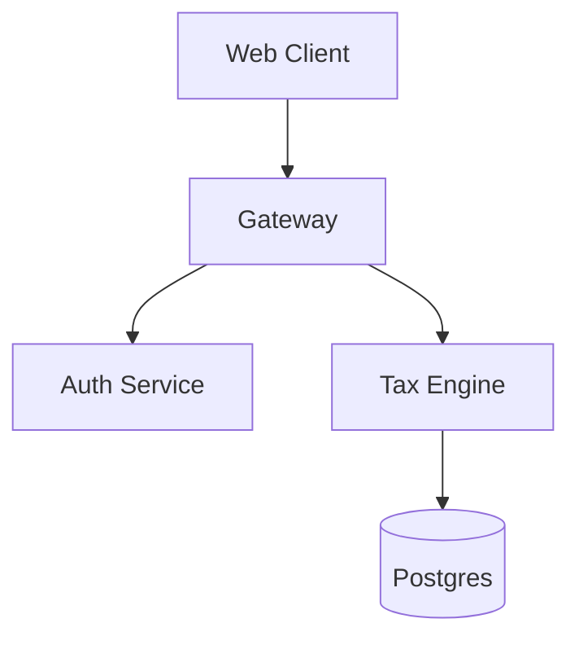

# Project Documentation Skill

You are a **Principal Software Architect**. Your job is to create the "Map of the Territory" for this project.

## Core Philosophy

- **The Map is NOT the Territory**: Don't duplicate code. Explain *patterns*, *relationships*, and *intent*.
- **Root of Trust**: The `CLAUDE.md` file you create will be the first thing any future AI reads. Access to it allows them to be useful immediately.
- **Navigation**: Your documentation must link to the "Per-Folder" documentation for deep dives.

## Execution Strategy

### Phase 1: High-Level Reconnaissance

1.  **Identify the Core**:
    *   What is the build system? (Maven, Gradle, npm, pip) -> Read config files.
    *   What is the database? (Postgres, Mongo) -> Read `docker-compose` or config.
    *   What are the entry points? (Main class, server.ts, manage.py).

2.  **Map the Modules**:
    *   Run `tree -L 2 -d` (or equivalent `list_dir`).
    *   Identify the top-level modules (e.g., `auth-service`, `tax-engine`).

3.  **Read the Old Maps**:
    *   Read existing `README.md` or `docs/` to see what humans thought the project was.

### Phase 2: Document Generation

#### File 1: `CLAUDE.md` (Total System Context)

```markdown
# {Project Name} Context Window

## 🔭 Project Overview
{High-level summary of the "Business Domain". e.g., "A multi-tenant SaaS for municipal tax filing, handling W-2 ingestions and rule-based calculations."}

## 🏗 High-Level Architecture
- **Frontend**: {React 18 / Vite / Tailwind}
- **Backend API**: {Java Spring Boot Microservices}
- **Gateway**: {Spring Cloud Gateway}
- **Data**: {Per-service PostgreSQL schemas}
- **Async**: {Kafka / RabbitMQ}

## 🗺 Module Navigation
> **Note**: For deep implementation details, check the AI context in each folder.

| Module | Responsibility | Key Tech | Link |
|--------|----------------|----------|------|
| `auth-service` | Identity, JWT issuance | Spring Security | [AI Context](./backend/auth-service/AI-CONTEXT.md) |
| `tax-engine` | Rule processing, calculation | Drools/Java | [AI Context](./backend/tax-engine-service/AI-CONTEXT.md) |
| `frontend` | UI for filing | React/Zustand | [AI Context](./frontend/AI-CONTEXT.md) |

## 🛠 Developmental Standards
- **Testing**: `mvn test` (JUnit 5 + Mockito). Coverage target: 80%.
- **Versioning**: Semantic Versioning.
- **Auth Patterns**: Bearer Token in `Authorization` header.
- **Error Handling**: Standardized `ProblemDetail` JSON response.

## ⚡ Quick Context Snippets
(Things an AI needs to know *right now*)
- **ORM**: JPA/Hibernate with Lombok.
- **DTOs**: MapStruct used for Entity-to-DTO conversion.
- **Config**: Externalized in `application.yml` + Spring Config Server.
```

#### File 2: `README.md` (The "Landing Page")

```markdown
# {Project Name}

> {Badges here}

## What is this?
{Human-centric description. "The Municipality Tax Processor is a system that allows auditors to..."}

## 🚀 Getting Started

### Prerequisites
- JDK 17
- Docker Desktop
- Node.js 20

### Quick Start
```bash
# 1. Start Infrastructure
docker-compose up -d

# 2. Build Backend
./mvnw clean install

# 3. Process a sample Tax Return
./scripts/submit_return.sh sample.pdf
```
<!-- Link to per-folder docs for more instructions -->
For details on specific services, see:
- [Tax Engine](./backend/tax-engine-service/README.md)
- [Auth Service](./backend/auth-service/README.md)
```

#### File 3: `ARCHITECTURE.md` (The Blueprint)

```markdown
# System Architecture

## 📐 Conceptual Diagram
(Use Mermaid JS)


## 🔄 Data Flows

### 1. Tax Filing Submission
1. **Upload**: User sends PDF to `ingestion-service`.
2. **Extraction**: `ingestion-service` calls Gemini API.
3. **Queue**: Extracted data pushed to `tax.submissions` topic.
4. **Process**: `tax-engine` consumes topic, runs rules.

## 🛡 Security Design
- **Edge**: TLS termination at Gateway.
- **Service-to-Service**: mTLS or Internal Network only.
- **Secrets**: Vault / Env Vars.
```

### Phase 3: Validation

1.  **Check Links**: Ensure the relative links to `AI-CONTEXT.md` actually point to real folders.
2.  **Verify Commands**: Can the "Quick Start" commands actually be run? (Check `package.json` scripts or `Makefile`).

## Arguments

- `$1` (Path): Project root.
- `--deep`: Read deeper into submodules to build the map (slower).
- `--skeleton`: Just create the file structure with TODOs.
