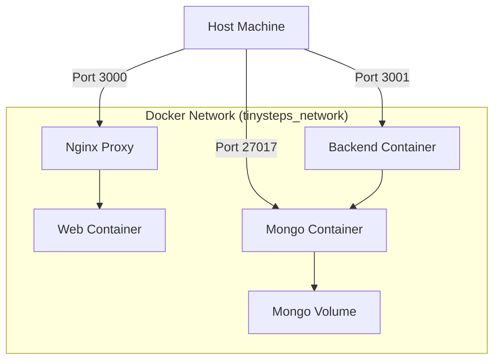

# BabyGo / TinySteps AI System Architecture

## Overview
TinySteps AI (BabyGo) is a comprehensive child development tracking platform designed to help parents monitor their child's growth and milestones. It leverages Google's Gemini AI to provide personalized insights and recommendations based on the child's developmental data.

---

## High-Level Architecture Diagram

```mermaid
graph TB
    subgraph "Client Layer"
        WEB[Web Application (React)]
        MOBILE[Mobile App (Flutter)]
    end
    
    subgraph "API Layer"
        GW[Nginx / API Gateway]
    end
    
    subgraph "Service Layer"
        BACKEND[Backend Service (Node.js/Express)]
    end
    
    subgraph "Data Layer"
        DB[(MongoDB)]
    end
    
    subgraph "External Services"
        GEMINI[Google Gemini AI]
    end
    
    WEB --> GW
    MOBILE --> GW
    GW --> BACKEND
    BACKEND --> DB
    BACKEND --> GEMINI
```

---

## Technology Stack

### Application Layer
| Component | Technology | Version |
|-----------|------------|---------|
| Web Framework | React / Vite | 18.x / 5.x |
| Mobile Framework | Flutter | 3.x |
| Backend Runtime | Node.js | >=18.0.0 |
| Backend Framework | Express | 4.18.2 |
| Database | MongoDB | 7.0 |

---

## Service Catalog

| Service | Port | Primary Responsibilities |
|---------|------|-------------------------|
| Backend API | 3001 | REST API, Auth, Data Persistence, AI Integration |
| Web App | 3000 | Frontend User Interface |
| MongoDB | 27017 | Data Storage (Users, Milestones, Growth Logs) |

---

## Deployment Architecture

The system is containerized using Docker Compose for local development and simplified deployment.



---

## Version History

| Version | Date | Changes |
|---------|------|---------|
| 1.0 | 2024-02-04 | Initial documentation and system setup |
