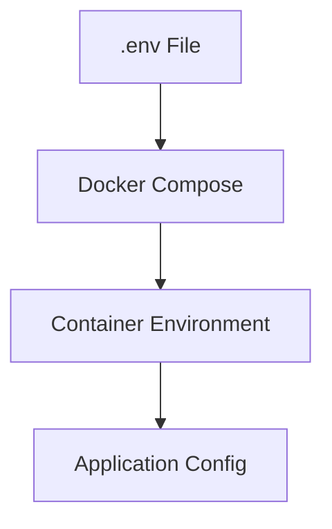

# BabyGo / TinySteps AI Configurable Design Documentation

## Overview
This system uses environment variables for configuration across all environments (Dev, Docker, Production).

---

## Configuration Architecture



---

## Configurable Components

### Backend API (`backend/`)

**Configurable Parameters:**

| Parameter | Default | Range | Description |
|-----------|---------|-------|-------------|
| `PORT` | 3001 | 1024-65535 | Port for the Express server |
| `NODE_ENV` | development | dev, prod, test | Environment mode |
| `MONGODB_URI` | mongodb://localhost... | Valid URI | Connection string for MongoDB |
| `JWT_SECRET` | - | String | Secret key for signing tokens |
| `GEMINI_API_KEY` | - | String | Google AI Studio API Key |
| `WEB_APP_URL` | http://localhost:3000 | URL | CORS allowed origin for Web |

### Web App (`tinysteps-ai/`)

**Configurable Parameters:**

| Parameter | Default | Description |
|-----------|---------|-------------|
| `VITE_API_URL` | /api | Base URL for Backend API calls (proxy or direct) |

---

## Configuration via Environment Variables

### Backend Example (`backend/.env`)

```bash
PORT=3001
NODE_ENV=development
MONGODB_URI=mongodb://localhost:27017/tinysteps
JWT_SECRET=super_secret_key_123
GEMINI_API_KEY=AIzaSy...
WEB_APP_URL=http://localhost:3000
```

### Docker Example (`docker-compose.yml`)

```yaml
services:
  backend:
    environment:
      - PORT=3001
      - MONGODB_URI=mongodb://mongo:27017/tinysteps
      - GEMINI_API_KEY=${GEMINI_API_KEY} # Passes through from host .env
```

---

## Configuration Best Practices
1.  **Secrets**: Never commit `.env` files. Use `.env.example` for templates.
2.  **Rotation**: Rotate `JWT_SECRET` and `GEMINI_API_KEY` periodically.
3.  **Production**: In production, inject these variables via the CI/CD pipeline or Container Orchestrator (e.g., K8s Secrets).
