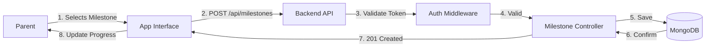
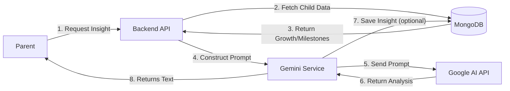
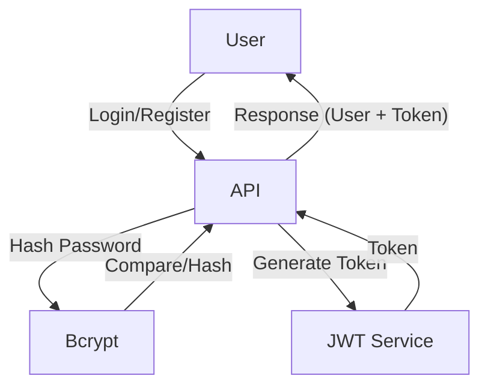

# BabyGo / TinySteps AI Data Flow Documentation

## Overview
This document outlines how data moves through the TinySteps AI system, from user inputs to storage and AI processing.

---

## High-Level Data Flow

```mermaid
flowchart TB
    subgraph "Input Sources"
        PARENT[Parent User]
        SENSORS[Device Sensors (Mobile)]
    end

    subgraph "Processing Layer"
        VALID[Express Validator]
        CONTROLLER[API Controllers]
        AI_HANDLER[AI Service Handler]
    end

    subgraph "Storage Layer"
        MONGO[(MongoDB)]
    end

    subgraph "Output Layer"
        JSON[JSON Response]
        UI[UI Update]
    end
    
    PARENT --> VALID
    VALID --> CONTROLLER
    CONTROLLER --> AI_HANDLER
    AI_HANDLER --> MONGO
    CONTROLLER --> MONGO
    MONGO --> JSON
    JSON --> UI
    AI_HANDLER --> JSON
```

---

## Core Data Flow Scenarios

### 1. Milestone Logging Flow



### 2. AI Insight Generation Flow



### 3. User Authentication Flow



---

## Data Transformation Pipeline

1.  **Input**: JSON payloads from React/Flutter clients.
2.  **Sanitization**: `express-validator` cleans inputs (email normalization, trimming).
3.  **Normalization**: Dates converted to ISO strings.
4.  **AI specific**: Child data (age, weight, milestones) formatted into a prompt string for Gemini.

## Integration Data Flows

### Google Gemini API
-   **Direction**: Outbound (Request) / Inbound (Response)
-   **Data**: Prompt text (Anonymized child metrics) -> Generative Text Response.
-   **Security**: API Key authentication (Server-side).
