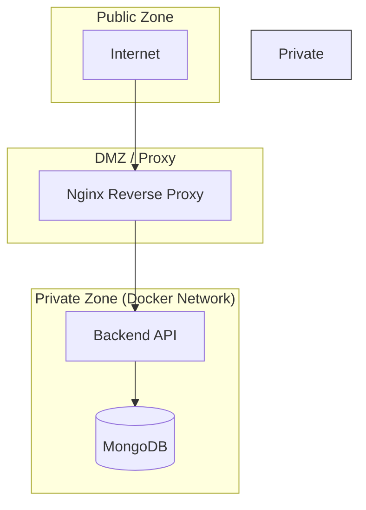
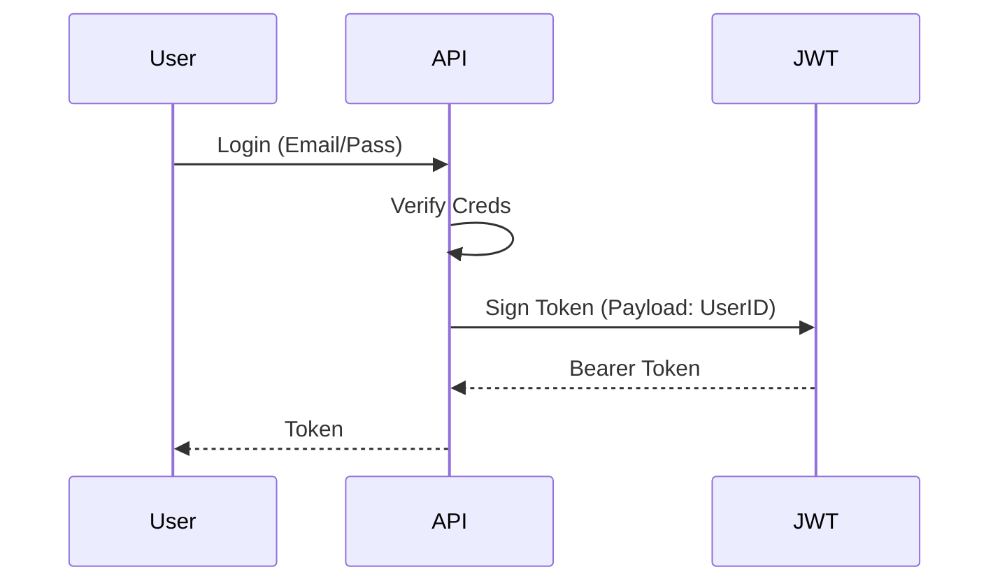

# BabyGo / TinySteps AI Data Security Documentation

## Overview
Security architecture focusing on authentication, authorization, and data protection.

---

## Security Architecture

---

## Authentication & Authorization

### Authentication Flow

### Role-Based Access Control
| Role | Permissions |
|------|------------|
| Parent (User) | Read/Write own data, Add Children, Log Milestones |
| Admin | Manage Users, View System Stats (Future) |

All API endpoints (except `/auth/*`) require a valid Bearer Token.

---

## Data Encryption

### At Rest
-   **Database**: Relies on host-level volume encryption or MongoDB Enterprise encryption (not currently enabled in community edition Docker setup).
-   **Passwords**: `bcrypt` (Salted rounds: 10).

### In Transit
-   **External**: HTTPS via Nginx or Cloud Provider Load Balancer.
-   **Internal**: HTTP within secure Docker network.

---

## Network Security

### Network Segmentation
The `docker-compose.yml` defines a specific network `tinysteps_network`.
-   **MongoDB** is NOT exposed to the host machine in production (remove `ports: "27017:27017"` in prod).
-   **Backend** is the only service that can talk to MongoDB.

### API Security
-   **Rate Limiting**: `express-rate-limit` configured to prevent brute force.
-   **CORS**: Restricted to `WEB_APP_URL`.
-   **Helmet**: Security headers enabled by default in Express.

---

## Audit Logging
-   **Logged Events**: Server start/stop, Uncaught exceptions, API 500 errors.
-   **Log Retention**: Docker logs (rotation configured via daemon).

## Incident Response
1.  **Detection**: Monitoring of 5xx error rates.
2.  **Mitigation**: Rollback deployment or restart containers.
3.  **Analysis**: Review application logs.
