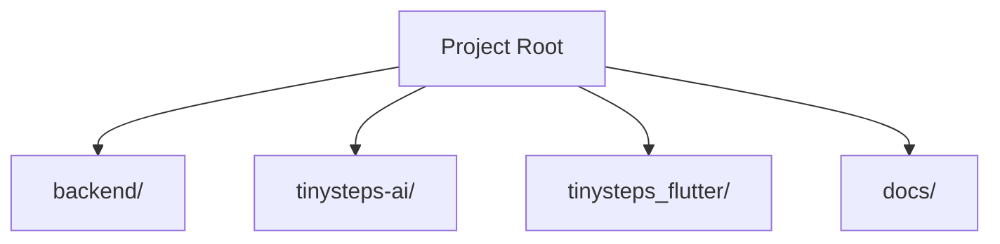

# BabyGo / TinySteps AI Modules List

## Overview
Breakdown of the codebase into functional modules.

---

## Module Architecture Overview

---

## Backend Modules (`backend/src`)

**Package/Path:** `backend/`

| Component | File | Responsibility |
|-----------|------|----------------|
| Server Entry | `index.js` | App initialization, middleware setup |
| Auth Controller | `controllers/authController.js` | Login, Register logic |
| Child Controller | `controllers/childController.js` | CRUD for Child profiles |
| Milestone Controller | `controllers/milestoneController.js` | Handling milestone logs |
| AI Service | `services/aiService.js` | Interface with Google Gemini API |
| Database Config | `config/db.js` | Mongoose connection setup |

**Key Dependencies**: `express`, `mongoose`, `jsonwebtoken`, `@google/generative-ai`

---

## Web Modules (`tinysteps-ai/src`)

**Package/Path:** `tinysteps-ai/`

| Component | File | Responsibility |
|-----------|------|----------------|
| App Entry | `main.tsx` | React root, Provider setup |
| Router | `App.tsx` | Route definitions (Dashboard, Login) |
| API Layer | `api/` | Axios instances, API wrapper functions |
| Components | `components/` | Reusable UI (Buttons, Charts, Forms) |
| Pages | `pages/` | Specific Views (Dashboard, Tracking) |

**Key Dependencies**: `react`, `vite`, `recharts`, `lucide-react`

---

## Mobile Modules (`tinysteps_flutter/lib`)

**Package/Path:** `tinysteps_flutter/`

| Component | File | Responsibility |
|-----------|------|----------------|
| App Entry | `main.dart` | Flutter Main, Theme config |
| Screens | `screens/` | UI Views (LoginScreen, HomeScreen) |
| Widgets | `widgets/` | Reusable Flutter widgets |
| Services | `services/` | HTTP calls to Backend API |
| Models | `models/` | Data classes (User, Child, Milestone) |

**Key Dependencies**: `flutter_sdk`, `http`, `provider/bloc`
