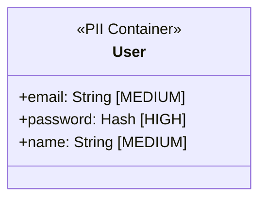
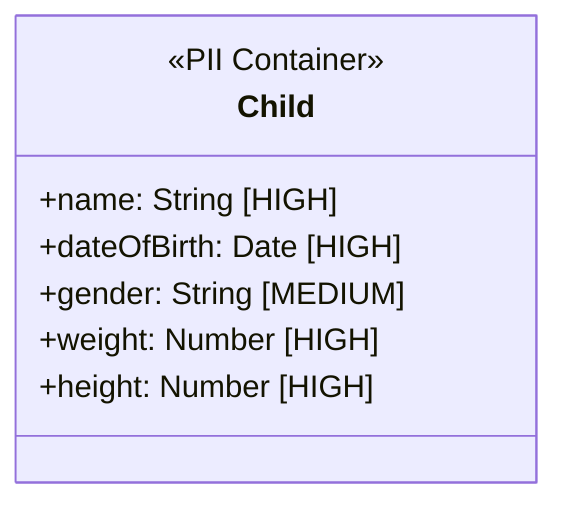
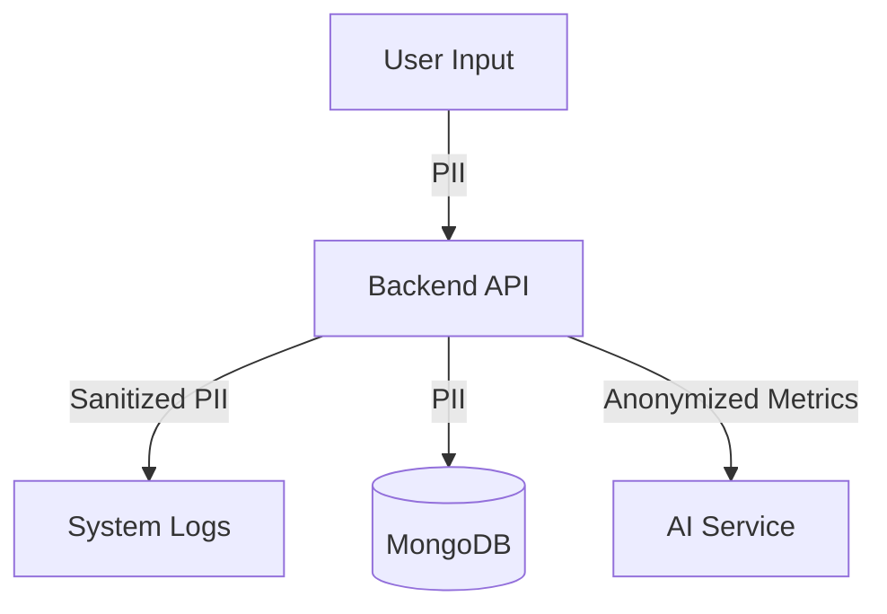

# BabyGo / TinySteps AI PII Data Documentation

## Overview
This system handles sensitive child and parent data. Proper handling of PII (Personally Identifiable Information) is critical for privacy compliance.

---

## PII Classification Levels

| Level | Description | Examples | Protection Requirements |
|-------|-------------|----------|------------------------|
| HIGH | Sensitive Personal Data | Child's Name, DOB, Medical/Growth Data | Encrypted at rest, Strict Access Control |
| MEDIUM | Contact Information | Parent Email, Phone Number | Access Control, TLS in transit |
| LOW | System Data | Internal IDs, App Settings | Standard Security |

---

## PII Data Inventory

### User (Parent) Profile

| Field | Classification | Storage | Encryption | Masking |
|-------|---------------|---------|------------|---------|
| email | MEDIUM | MongoDB | Standard | Partial (e***@domain.com) |
| password | HIGH | MongoDB | Bcrypt Hash | Redacted in Logs |
| name | MEDIUM | MongoDB | Standard | None |

### Child Profile

| Field | Classification | Storage | Encryption | Masking |
|-------|---------------|---------|------------|---------|
| name | HIGH | MongoDB | Standard* | First Name Only |
| dateOfBirth | HIGH | MongoDB | Standard* | Age in Months |
| Medical Data | HIGH | MongoDB | Standard* | Aggregated |

*\*Note: Currently stored as standard text in MongoDB. Recommendation: Enable MongoDB Encryption at Rest.*

---

## Data Flow Map with PII Indicators

---

## Protection Measures

### Encryption
-   **In Transit**: All data transmitted over HTTPs (TLS 1.2+).
-   **At Rest**: MongoDB volume encryption (if configured in deployment). User passwords are strictly hashed using `bcrypt`.

### Access Controls
-   **Authentication**: JWT Token required for all API access.
-   **Authorization**: Users can only access their own children's data (Resource-level ownership checks).

### Data Masking Rules
-   **AI Prompts**: Do not send the child's *name* or *exact DOB* to Gemini. Send "Age in months" and "Gender" instead.
-   **Logs**: Never log request bodies on `/auth/login` or `/auth/register`.

### Data Retention
-   Data is retained as long as the user account is active.
-   User deletion triggers cascading deletion of all associated PII (Child profiles, logs).

## Compliance Requirements
-   **COPPA**: As a app dealing with children, parental consent and data minimization are key. The app is designed for *parents* to use, not children directly.
-   **GDPR**: Users have the right to export or delete their data (Implementation pending).
