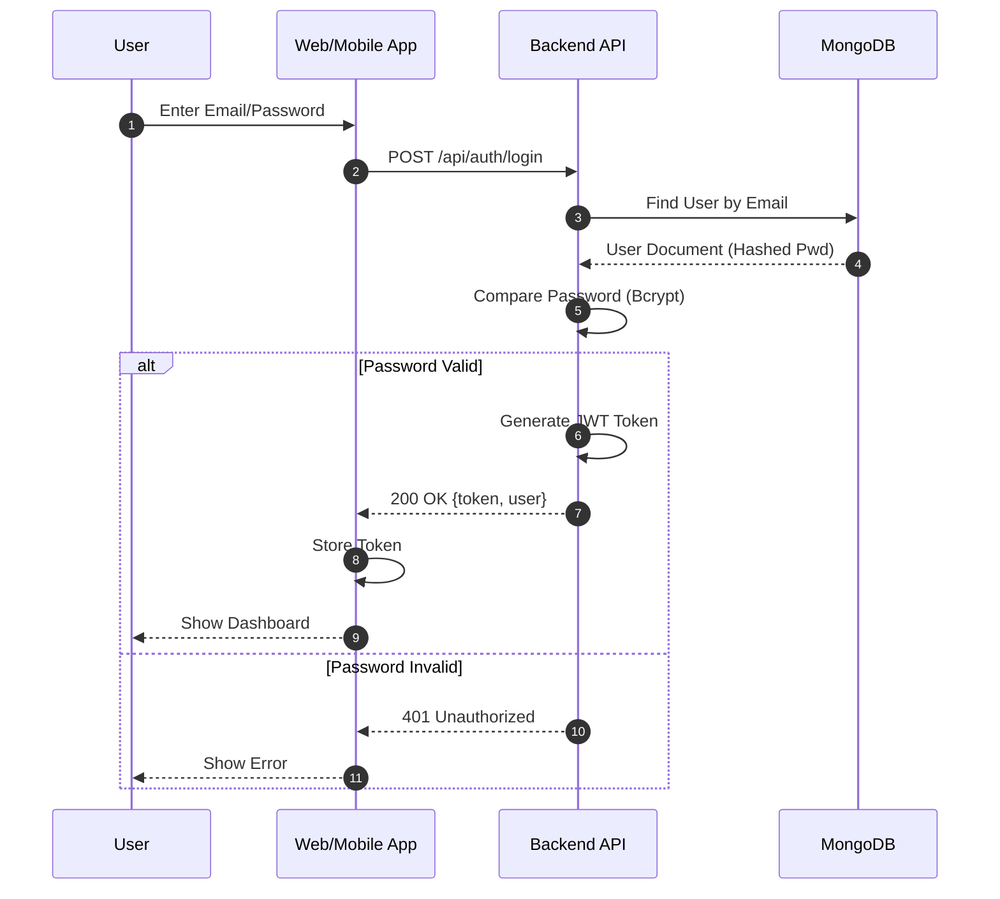
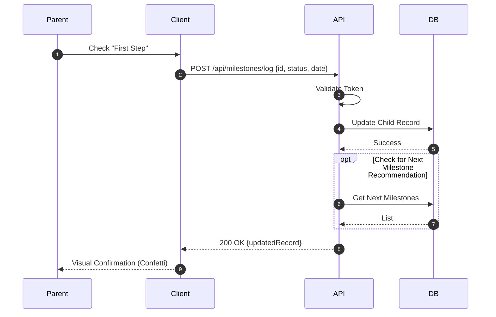
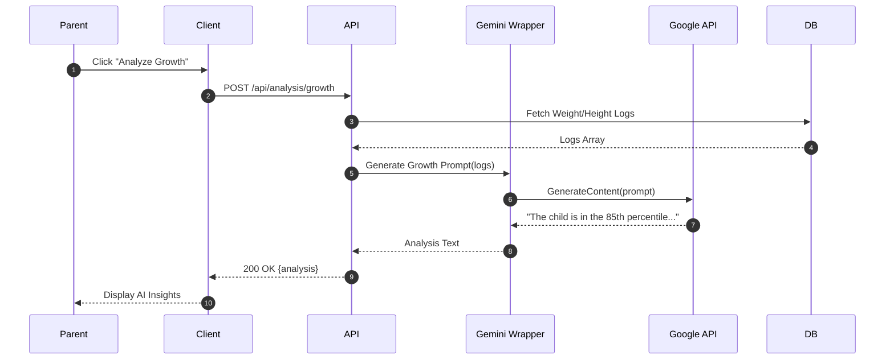
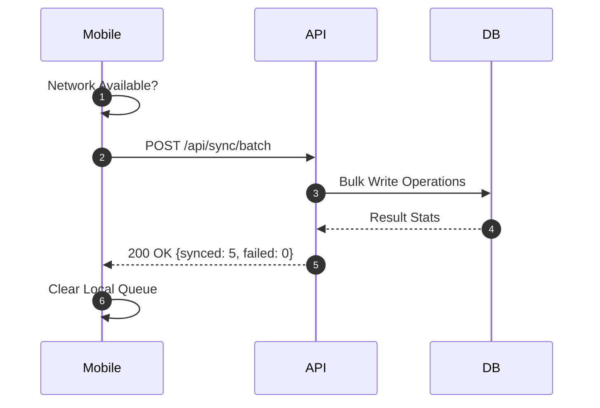
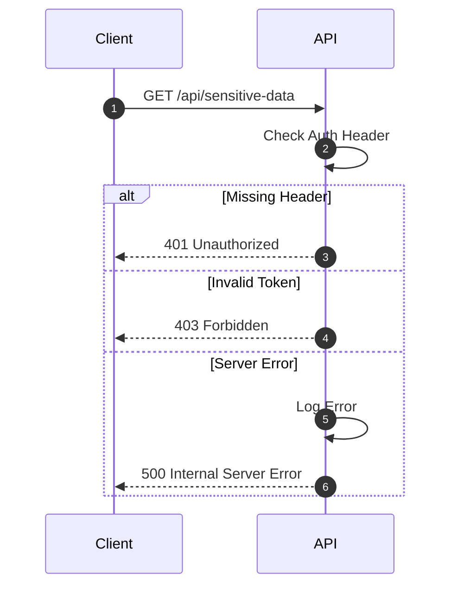

# BabyGo / TinySteps AI Sequence Diagrams

## Overview
Detailed sequence diagrams for critical system interactions.

---

## 1. Authentication Flow

## 2. Milestone Tracking

## 3. AI Growth Analysis

## 4. Background Data Sync (Mobile)

## 5. Error Handling

